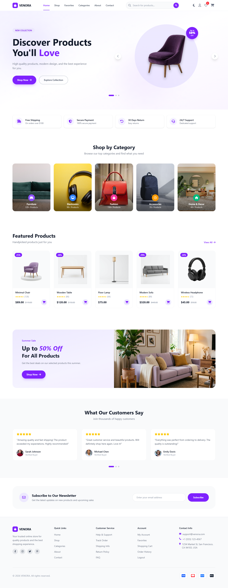
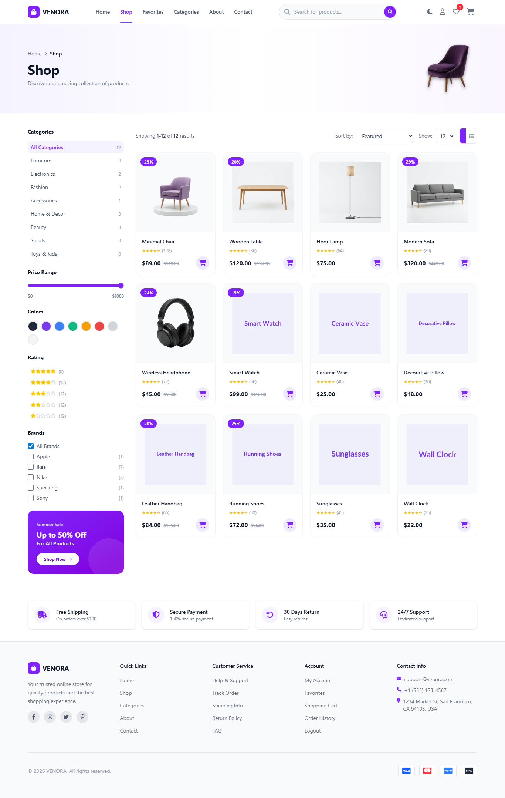
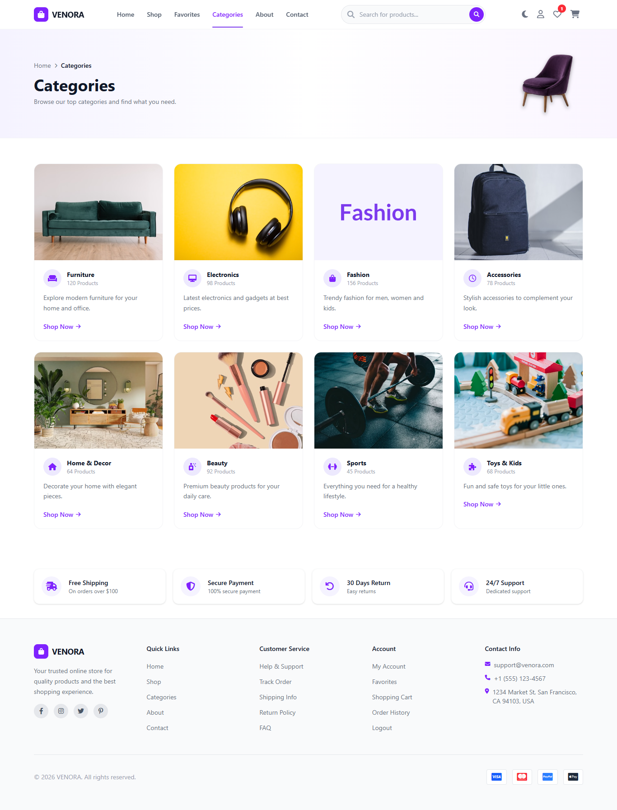
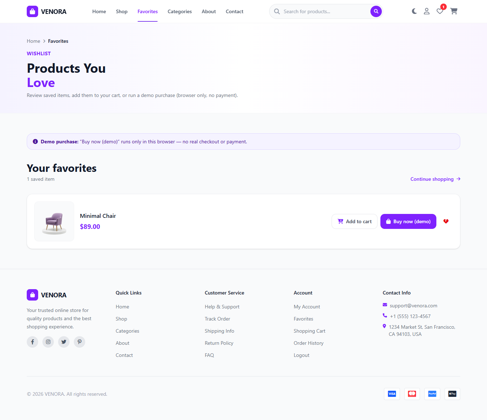
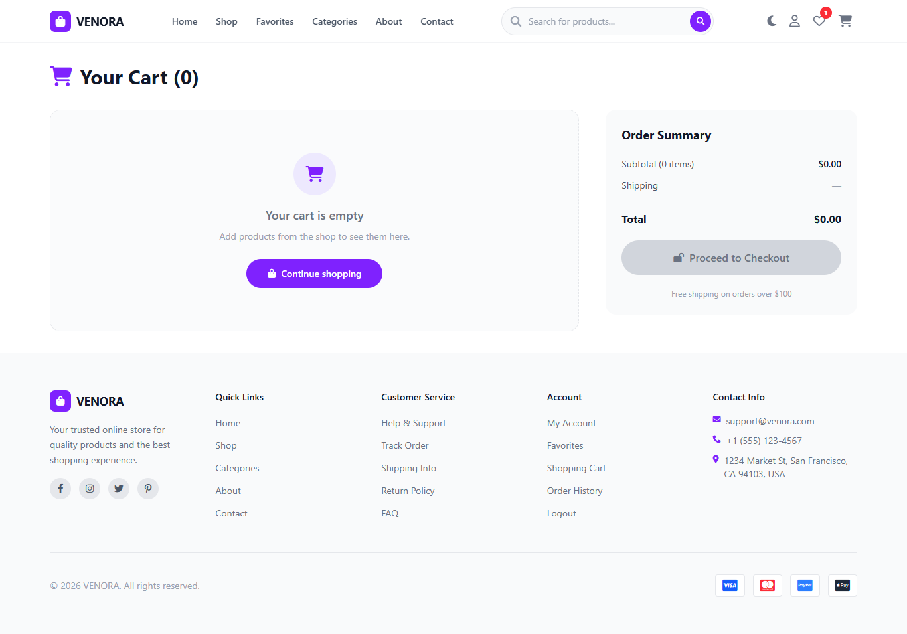
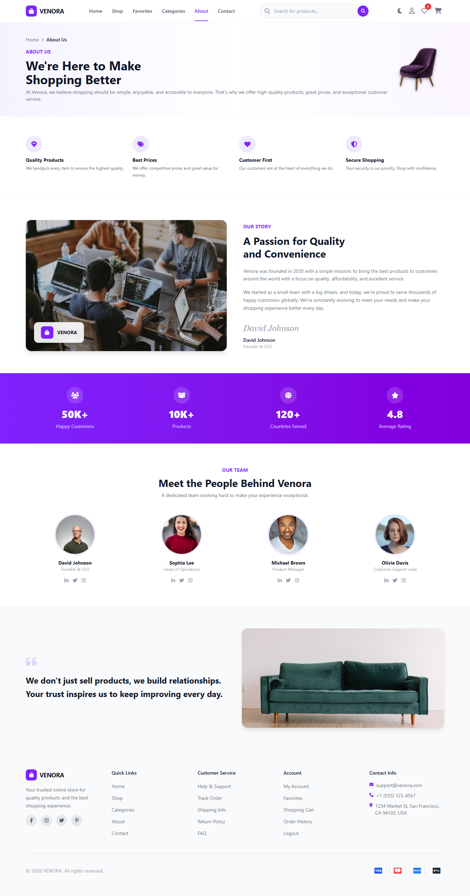
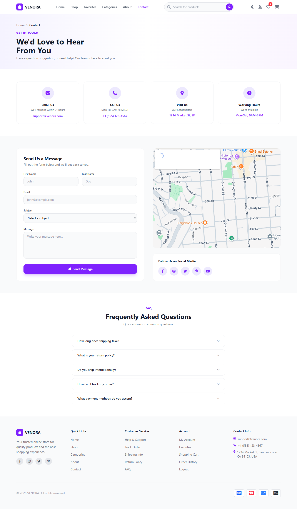

# VENORA — Template UI E-Commerce

[](https://vitejs.dev/)
[](https://tailwindcss.com/)
[](https://developer.mozilla.org/en-US/docs/Web/JavaScript)

Template **e-commerce multi-kategori** (furniture, elektronik, fashion, aksesoris, home decor) berbasis **HTML statis + vanilla JavaScript (ES modules)**. Tanpa React/Vue — UI dibangun lewat fungsi `create*()` / `mount*()` yang merender DOM, distyling dengan **Tailwind CSS v4**, dan dibundle dengan **Vite 8**.

> Cocok untuk portofolio, demo klien, atau landasan proyek sebelum backend ditambahkan. Cart, wishlist, dan tema disimpan di `localStorage`.

---

## Cuplikan Layar

### Home


### Shop


### Categories


### Wishlist


### Cart


### About


### Contact


---

## Fitur per Halaman

| Halaman | URL dev (Vite) | Modul utama | Fitur |
|---------|----------------|-------------|--------|
| **Home** | `/` atau `/src/pages/home/` | `sections/home-content.js` | Navbar, hero carousel, trust badges, kategori (5 kartu), produk unggulan, promo banner, testimoni, newsletter, footer |
| **Shop** | `/src/pages/shop/` | `pages/shop/shop-page.js` | Pencarian, filter (kategori, harga, warna, rating, merek), sort, pagination, tampilan grid/list, sinkron `?category=` dari URL |
| **Product** | `/src/pages/product/?id=1` | `pages/product/product-detail-page.js` | Galeri thumbnail, harga & diskon, rating, pilihan warna, qty, add to cart, buy now → cart |
| **Categories** | `/src/pages/categories/` | `sections/categories-grid.js` | Grid 8 kategori → link ke shop dengan `?category={slug}` |
| **Cart** | `/src/pages/cart/` | `pages/cart/cart-page.js` | Daftar item, ubah qty, ringkasan order, ongkir (gratis jika subtotal > $100), **demo checkout** (modal, kosongkan cart) |
| **Wishlist** | `/src/pages/wishlist/` | `sections/wishlist-content.js` | Daftar favorit, add to cart, hapus, **demo checkout** per item |
| **About** | `/src/pages/about/` | `pages/about/about-page.js` | Hero halaman, konten tentang brand |
| **Contact** | `/src/pages/contact/` | `pages/contact/contact-page.js` | Form kontak & info (UI saja) |
| **Login** | `/src/pages/auth/login.html` | `components/auth/login-page.js` | Form login + tombol sosial (tanpa backend) |
| **Register** | `/src/pages/auth/register.html` | `components/auth/register-page.js` | Form daftar (tanpa backend) |

**Global (semua halaman dengan navbar):** toggle dark/light (`venora_theme`), badge jumlah cart & wishlist, navigasi responsif.

---

## Tech Stack

| Teknologi | Peran |
|-----------|--------|
| [Vite 8](https://vitejs.dev/) | Dev server, HMR, multi-page build ke `dist/` |
| [Tailwind CSS v4](https://tailwindcss.com/) + `@tailwindcss/vite` | Utility-first styling, variant `dark` pada root `.dark` |
| Vanilla ES modules | Komponen sebagai factory function, tanpa framework UI |
| [Font Awesome 6](https://fontawesome.com/) (CDN) | Ikon |
| [Inter](https://fonts.google.com/specimen/Inter) (Google Fonts) | Tipografi utama |
| `localStorage` | Cart (`ecommerce_cart`), wishlist (`ecommerce_wishlist`), tema (`venora_theme`) |

---

## Memulai

### Prasyarat

- [Node.js](https://nodejs.org/) **18+** (LTS disarankan)

### Install & jalankan

```bash
git clone <URL_REPO_ANDA>
cd "Template e-Commerce TailwindCSS"
npm install
npm run dev
```

Buka URL yang ditampilkan Vite (biasanya `http://localhost:5173`).

### Build produksi

```bash
npm run build
npm run preview
```

Output ada di `dist/`. Semua entry HTML didefinisikan di `vite.config.js` → `build.rollupOptions.input`.

---

## Struktur Proyek

```text
Template e-Commerce TailwindCSS/
├── index.html                      # Entry home (root) — sama isinya dengan src/pages/home/
├── preview/                        # Screenshot untuk dokumentasi / README
├── public/
│   ├── favicon.svg
│   └── images/
│       ├── banners/                # Aset hero & promo (lokal)
│       └── products/               # Beberapa gambar produk (sisanya fallback placeholder)
├── src/
│   ├── main.js                     # Entry global: import CSS + helper tema (get/set/toggle)
│   ├── styles/
│   │   └── main.css                # @import tailwindcss, font Inter, variant dark
│   ├── layouts/                    # Referensi shell HTML (tidak di-import otomatis)
│   │   ├── main-layout.html
│   │   └── auth-layout.html
│   ├── components/
│   │   ├── layout/                 # navbar, footer, container, page-hero
│   │   ├── product/                # product-card, product-grid, product-gallery
│   │   ├── cart/                   # cart-item, cart-summary (+ modal demo checkout)
│   │   ├── auth/                   # login-page, register-page, auth-brand
│   │   └── ui/                     # button, badge, input, modal
│   ├── sections/                   # Blok halaman yang bisa digabung (home, wishlist, dll.)
│   │   ├── home-content.js         # Orkestrasi seluruh section home
│   │   ├── hero.js, trust-badge.js, categories.js, featured-products.js
│   │   ├── promo-banner.js, testimonials.js, newsletter.js
│   │   ├── categories-grid.js      # Grid halaman Categories
│   │   ├── wishlist-content.js     # Konten halaman Favorites
│   │   ├── about-content.js, contact-content.js
│   ├── pages/                      # Satu folder per rute: index.html + (opsional) *-page.js
│   │   ├── home/index.html
│   │   ├── shop/                   # shop-page.js → mountShopPage()
│   │   ├── product/                # product-detail-page.js → createProductDetailMain()
│   │   ├── categories/index.html   # Mount inline di HTML
│   │   ├── cart/                   # cart-page.js → mountCartPage()
│   │   ├── wishlist/               # wishlist-page.js → createWishlistMain()
│   │   ├── about/, contact/
│   │   └── auth/                   # login.html, register.html
│   ├── data/
│   │   ├── products.js             # 12 produk demo
│   │   ├── categories.js           # 8 kategori (slug untuk URL shop)
│   │   └── users.js                # Data contoh (belum dipakai auth)
│   ├── store/
│   │   ├── cartStore.js            # CRUD cart + listener onCartChange
│   │   ├── wishlistStore.js        # toggle / remove + listener onWishlistChange
│   │   └── uiStore.js              # State UI (menu/modal) — tersedia, belum terhubung ke komponen
│   └── utils/
│       ├── formatCurrency.js
│       ├── helpers.js              # debounce, slugify, getQueryParam, createElement
│       └── truncateText.js
├── vite.config.js
└── package.json
```

### Pola arsitektur

1. **Setiap halaman** = file `index.html` tipis dengan `<div id="app">` + `<script type="module">` yang mengimpor satu modul mount/create.
2. **`src/main.js`** selalu di-load untuk CSS global dan inisialisasi tema.
3. **`create*()`** — mengembalikan `HTMLElement` / `DocumentFragment` (komponen & section statis).
4. **`mount*()`** — merender ke `#app` dan mendengarkan perubahan store (shop, cart).
5. **Data** — file JS statis di `src/data/`; ganti/extend untuk menambah produk atau kategori.

---

## Data Demo

### Produk (`src/data/products.js`)

12 item dengan field: `id`, `name`, `slug`, `price`, `originalPrice`, `image`, `category`, `rating`, `reviews`, `colors`, `brand`, `description`.

Kategori produk yang dipakai: **Furniture**, **Electronics**, **Lighting**, **Fashion**, **Accessories**, **Home & Decor**.

### Kategori (`src/data/categories.js`)

8 kategori dengan `slug` untuk deep link shop, misalnya:

`/src/pages/shop/?category=furniture` → filter otomatis ke kategori **Furniture**.

| Slug | Nama |
|------|------|
| `furniture` | Furniture |
| `electronics` | Electronics |
| `fashion` | Fashion |
| `accessories` | Accessories |
| `home-decor` | Home & Decor |
| `beauty` | Beauty |
| `sports` | Sports |
| `toys-kids` | Toys & Kids |

> Beberapa slug kategori belum punya produk di `products.js` — filter shop akan menampilkan hasil kosong sampai data ditambah.

---

## State & Persistensi

| Store | Key `localStorage` | API utama |
|-------|-------------------|-----------|
| Cart | `ecommerce_cart` | `addToCart`, `removeFromCart`, `updateQty`, `clearCart`, `getCartCount`, `onCartChange` |
| Wishlist | `ecommerce_wishlist` | `toggleWishlist`, `isInWishlist`, `removeFromWishlist`, `onWishlistChange` |
| Tema | `venora_theme` (`light` / `dark`) | `getTheme`, `setTheme`, `toggleTheme` di `main.js` |

**Aturan ongkir (cart):** $10 flat; **gratis** jika subtotal > $100. Checkout hanya simulasi frontend — tidak ada pembayaran atau API.

---

## Kustomisasi

- **Branding & copy** — komponen di `components/` dan `sections/`
- **Produk & kategori** — `src/data/products.js`, `src/data/categories.js`
- **Gambar lokal** — `public/images/` (path di data mengikuti `/images/...`)
- **Tema warna** — utility Tailwind `violet-*` di seluruh template
- **Backend** — ganti `cartStore` / `wishlistStore` dengan fetch API; hubungkan form auth ke endpoint nyata
- **Deploy** — static hosting (GitHub Pages, Vercel, Netlify) dari `npm run build`

---

## Scripts

| Perintah | Fungsi |
|----------|--------|
| `npm run dev` | Dev server + HMR |
| `npm run build` | Build produksi multi-page → `dist/` |
| `npm run preview` | Preview build lokal |

---

## Lisensi

Tambahkan file `LICENSE` (mis. MIT) sesuai cara Anda ingin membagikan template ini. Tanpa lisensi eksplisit, hak cipta tetap pada pembuat.

---

<p align="center">
  <b>VENORA</b> — template UI e-commerce modern, siap jadi landasan portofolio atau proyek klien.
</p>
